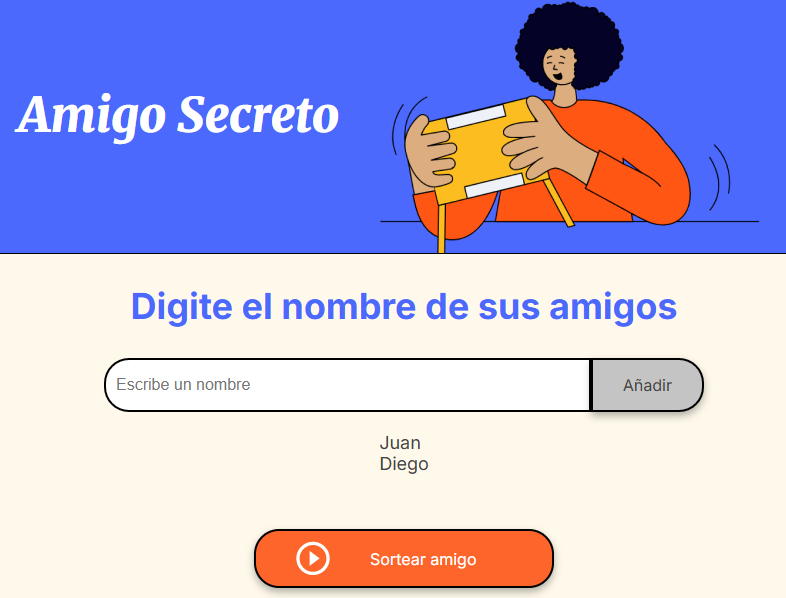
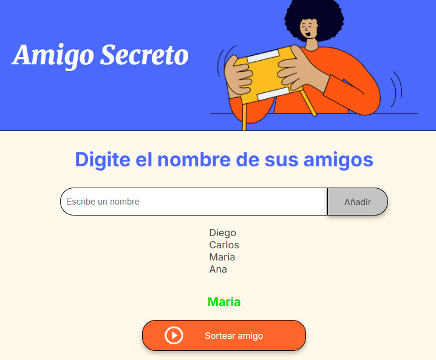
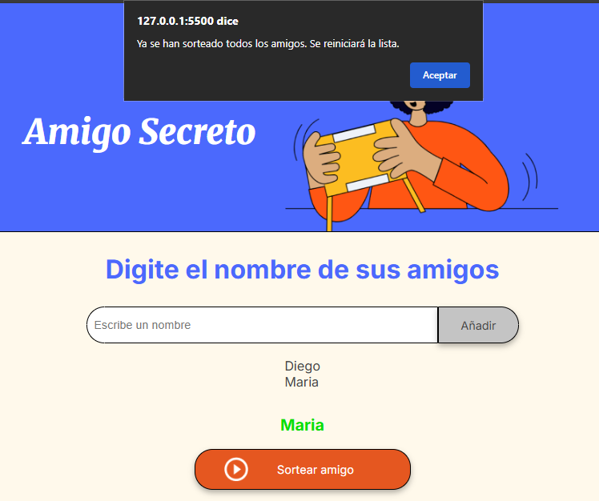

# Descripción del Proyecto

Primer challenge del curso de Oracle Next Education con Alura Latam. El challenge consiste en desarrollar un juego con JS donde se crea una lista con nombres de amigos y se debe de sortear de manera aleatoria, asignando un amigo secreto por cada juego, validando que la lista no este vacia, que no se repitan los amigos secretos, mostrando el amigo asignado en el sorteo, entre otras funcionalidades. 

# :hammer:Funcionalidades del Proyecto

- `Funcionalidad 1`: se almacenan los nombres de los amigos en un Array 

- `Funcionalidad 2`: De forma aleatoria se selecciona un amigo, el sistema esta configurado para nunca mostrar el mismo amigo dos veces en el mismo juego

- `Funcionalidad 3`: Una vez se han sorteado todos los amigos el juego se resetea, para agregar nuevos amigos a la lista y realizar un nuevo sorteo

# Autor

| [ Elier Antonio Sulbará Rodríguez](https://github.com/ElierSul) 

